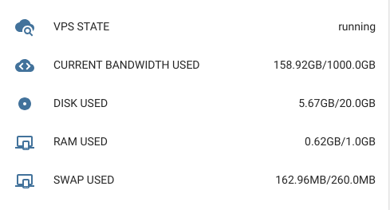

# homeassistant-bandwagonhost
用于home assistant平台的搬瓦工状态监视器,可以监视搬瓦工VPS的流量、内存和硬盘使用情况。  

## 安装
请将本工程文件克隆到 `<config>/custom_components/` 下

## 配置 
```yaml
sensor:
  - platform: homeassistant-bandwagonhost
    veid: 搬瓦工VPS的veid         # 必须
    api_key: 搬瓦工VPS的API_KEY   # 必须
    monitored_conditions:         # 可选
      - VPS_STATE                 # 可选，VPS运行状态
      - CURRENT_BANDWIDTH_USED    # 可选，流量情况
      - RAM_USED                  # 可选，已用内存
      - DISK_USED                 # 可选，已用硬盘
      - SWAP_USED                 # 可选，已用SWAP
```
以上信息请从搬瓦工的控制页面获取。

## 效果示例


## 注意
为了防止因为api请求过于频繁而被搬瓦工封号，传感器每20分钟更新一次。
